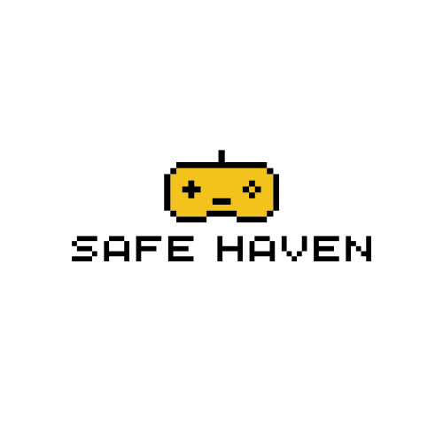

# Safe Haven - A LibGDX Tile-Based Game

<p align="center">
  
</p> 

## Project Overview

Safe Haven is built using the power of LibGDX, following the principles outlined in the book Mastering LibGDX The game features an entity component system design pattern, intricate inventory systems, HUG layouts for UI, serialization for saving/loading progress, dynamic dialog trees, captivating quests, and even dramatic instances. The inclusion of shop and store UIs adds depth to the in-game experience, while screen transitions seamlessly guide players through different aspects of the game.

## Features

- **Entity Component System (ECS) Design Pattern:** Organize your game logic using an efficient and flexible ECS architecture.
- **Inventory System:** Manage items, equipment, and resources with a robust inventory system.
- **HUG Layouts:** Utilize Heads-Up-Display (HUG) layouts for clear and intuitive user interfaces.
- **Serialization (Saving/Loading):** Save and load game progress with a serialization system, ensuring players can continue their adventures seamlessly.
- **Dialog Trees:** Create dynamic and branching dialogues with an easy-to-use dialog tree system.
- **Shop and Store UIs:** Implement shop and store interfaces for players to buy and sell items.
- **Quest System:** Design and integrate quests to provide players with goals and challenges.
- **Monsters and Bosses:** Populate your game world with various monsters and challenging bosses.
- **Dramatic Instances:** Engage players with dramatic instances, adding depth and excitement to the gameplay.
- **Screen Transitions:** Enhance user experience with smooth transitions between different game screens.
- **Obfuscation:** Protect your code and assets using obfuscation techniques.

## Tools Used

- **LibGDX:** The game is developed using the LibGDX framework, providing a powerful and versatile environment for cross-platform game development.
- **Tiled:** Design intricate and detailed levels with the Tiled map editor.
- **Audacity:** Create and edit audio assets with Audacity for a rich auditory experience.
- **Packr:** Package your LibGDX game into executable JARs and native executables for distribution.
- **Proguard:** Obfuscate and shrink your code with Proguard to enhance security and reduce file sizes.

## Getting Started

1. **Clone the Repository:**
   ```bash
   git clone https://github.com/qbb84/SafeHaven.git
